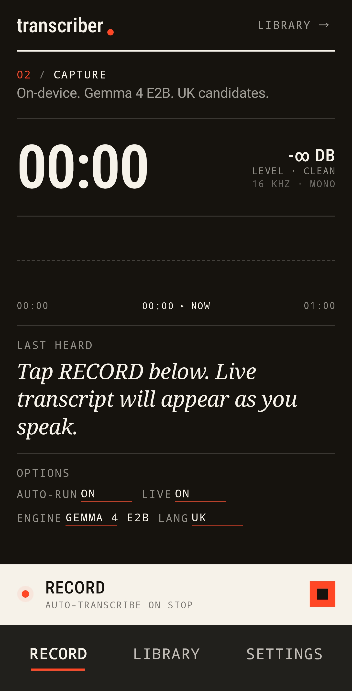
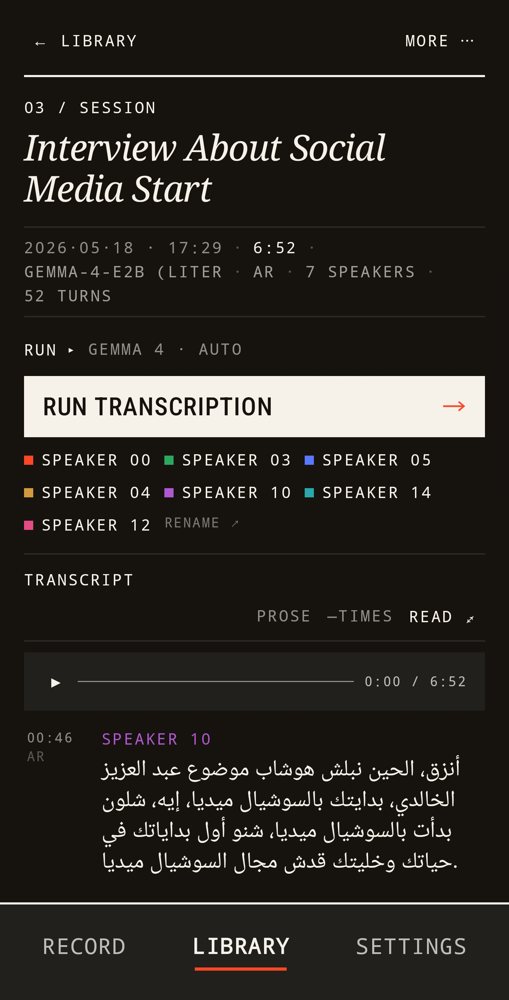
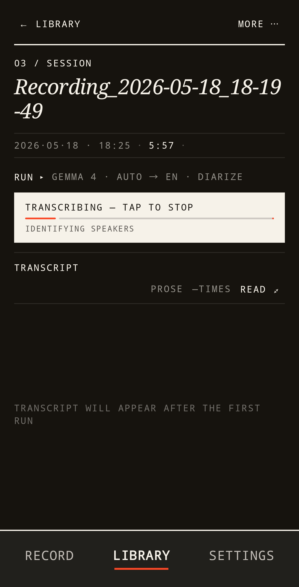
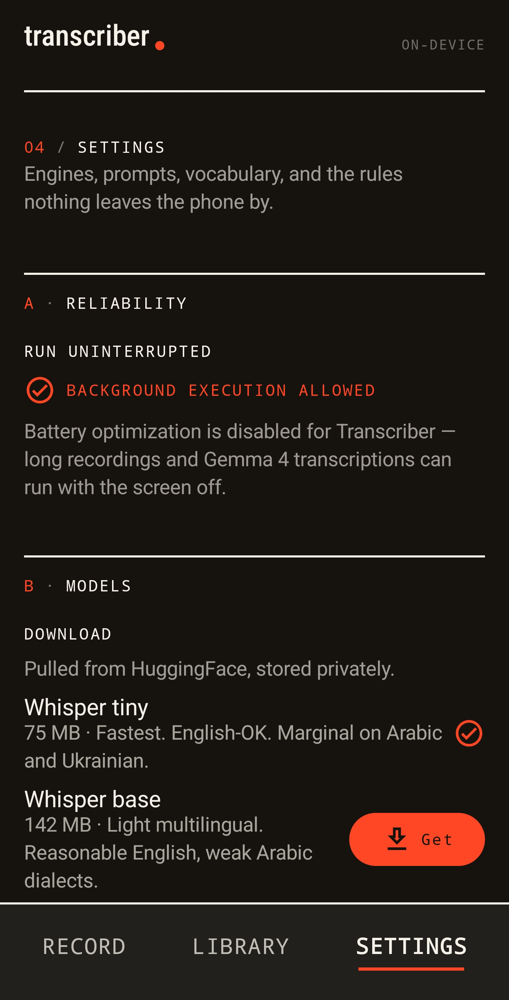
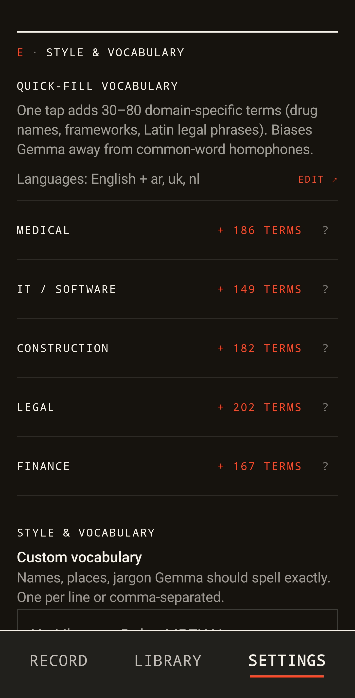

# Transcriber for Android

Standalone open-source Android transcription app. Records or imports audio (WAV / MP3 / M4A / AAC / OGG / FLAC), runs on-device ASR through Whisper.cpp or Gemma 4, diarizes speakers, and surfaces a Material 3 UI with post-processing presets. APK-distributed (no Play Store).

**Status: 1.0.0.** Recording, file import, transcription (Parakeet by default, Omnilingual for Arabic, whisper.cpp and Gemma 4 as alternatives, plus a Super mode that runs two engines and vote-merges), diarization (sherpa-onnx OR Gemma prompt-based), auto-titling, inline segment editing, four post-processing presets (Summary / Context-aware rewrite / Clean / Translate-polish), custom vocabulary, tone styles, snippets, multi-select constrained-auto language picker (Arabic / Ukrainian / English / Dutch), live transcription, and a Settings page with Gemma 4 compute knobs (GPU/CPU, context window, CPU threads).

The current roadmap — a research-backed plan to bring this app to parity with the Mac app — lives at [docs/PLAN-2026-09.md](docs/PLAN-2026-09.md). Superseded planning notes are in [NEXT_STEPS.md](NEXT_STEPS.md).

---

## Screenshots

Editorial "ink-on-paper" design — paper background, single orange accent, monospace chrome. Dark mode shown.

<p align="center">
  
  
  
  
  
</p>

<p align="center"><sub>Record · Diarized session (Arabic, RTL) · Live transcribe · Settings/models · Quick-fill vocabulary</sub></p>

---

## Requirements

- **Android Studio Iguana** (or newer) — Hedgehog onward also works.
- **JDK 17 or 21** — bundled with recent Android Studio installs.
- **Android NDK 30.0.16248370** (r30 LTS) — installable from the SDK Manager, or auto-installed on first Gradle sync if licenses are pre-accepted. Needed for whisper.cpp's native build.
- **CMake 3.22.1** — also via the SDK Manager.
- **A device with API 29+** (Android 10) and a working microphone. Real device strongly preferred — the emulator's mic + GPU acceleration are flaky and Gemma 4's `~2.6 GB` weights load slowly on emulators.

---

## Setup

```bash
# 1. From the repo root: pull whisper.cpp into app/src/main/cpp/whisper.cpp/.
./scripts/fetch-whisper-cpp.sh

# 2. Pull the official sherpa-onnx Android AAR into app/libs/ (ASR engines +
#    diarization). Neither of these native deps is vendored in git — see
#    app/libs/README.md.
./scripts/fetch-sherpa-onnx.sh

# 3. Open in Android Studio — it will prompt to install matching NDK + CMake.
#    Or build from the CLI:
export JAVA_HOME="/Applications/Android Studio.app/Contents/jbr/Contents/Home"
export ANDROID_HOME="$HOME/Library/Android/sdk"
./gradlew :app:assembleDebug
./gradlew :app:installDebug   # if a device is connected
```

### Provision a model

The app has a Settings → **Download a model** flow with curated entries:
| Model | Size | Purpose |
|---|---|---|
| Whisper tiny | 75 MB | Live transcription, smallest |
| Whisper small | 466 MB | File transcription baseline |
| Whisper large-v3-turbo q5_0 | 574 MB | Best Whisper for Arabic dialects + Ukrainian |
| **Gemma 4 E2B (audio)** | **2.59 GB** | **Default. Transcribe + translate + Gemma-diarize in one model.** |
| Gemma 4 E4B (audio) | 3.49 GB | Bigger Gemma, slower per chunk |
| Speaker embedding (compact, CAM++ English) | 28 MB | Sherpa-onnx hybrid diar baseline |
| Speaker embedding (multilingual, CAM++ zh+en) | 28 MB | Modest improvement on code-switched audio |
| Speaker embedding (high accuracy, WeSpeaker ResNet221-LM) | 95 MB | Best EER, ~3× slower clustering |

Multiple embedding models can coexist on disk; pick the active one in **Settings → Models → ACTIVE EMBEDDING MODEL** (radio selector appears when ≥2 are installed). The default cascade is WeSpeaker > CAM++ multilingual > CAM++ English.

You can also import any `*.bin` / `*.litertlm` via Settings → **Import custom model file**.

If your Gemma 4 `.litertlm` was downloaded before **2026-05-05** (LiteRT-LM 0.11.0 release date), Settings will show an "Update" button next to the entry. Re-downloading enables MTP speculative decoding for ~2× faster decode on mobile GPUs — purely a runtime win, no UX changes.

---

## Architecture

For the full end-to-end story of how Gemma 4 is wired into the app —
engine lifecycle, the channelFlow/AtomicReference trick for streaming
text, VAD-aligned chunking, hybrid diarization, prompt-leak scrubbing,
the hang/retry/rebuild loop — read **[docs/GEMMA4_INTEGRATION.md](docs/GEMMA4_INTEGRATION.md)**.
Recommended reading before changing anything in `asr/`.

```
ui/
   record/        record screen + ViewModel, live-transcript card
   recordings/    list + tabbed detail (Transcript / Summary / Clean / …)
   settings/      models, prompts, presets, snippets, tone, battery exemption
   nav/           Material 3 bottom-nav + NavHost
   theme/         M3 dynamic colors, typography
   MarkdownText   minimal markdown renderer for Gemma outputs
   KeepScreenOn   pins the screen on during long jobs

data/
   AppContainer   hand-rolled DI, one per process
   AppDatabase    Room (Recording + Segment + OutputDoc)
   RecordingRepository

audio/
   WavRecorder        AudioRecord → 16 kHz mono WAV, emits 5-sec chunk Flow
   AudioDecoder       MediaExtractor + MediaCodec; full decode + streaming
   RecordingService   foreground service (microphone FGS type)
   WakeLockHelper     PARTIAL_WAKE_LOCK so long jobs survive screen-off
   BatteryOptimization helper for the Samsung exemption prompt

asr/
   AsrBackend (interface)
   WhisperCppBackend     JNI bridge → whisper.cpp
   Gemma4Backend         LiteRT-LM Engine; audio + text-gen; Google's "in X into X"
                         user-message template; SamplerConfig(temp=0.1) for ASR
   AsrFactory            backend creation, model resolve, selected-model pin
   GemmaSettingsStore    user-configurable compute knobs (backend / max tokens / threads)
   TranscriptionRunner   end-to-end pipeline (streams for Gemma, full-buffer for Whisper)
   DiarizationRunner     sherpa-onnx speaker diarization (alternative to Gemma's)
   LiveTranscriber       streaming-chunk worker for the Record screen
   PostProcessor         runs presets (Summary / Context-aware rewrite /
                         Clean / Translate-polish) via Gemma
   PromptStore           system instructions, vocabulary, fillers, verbatim, tone,
                         one-shot migration from legacy prompt defaults
   PresetStore           post-processing preset templates
   SnippetStore          named text fragments referenced via {snippet:name}
   ModelCatalog          curated download list
   ModelDownloader       resumable HF download (atomic via .partial)
   TranscriptExporter    .txt / .srt / .json sidecars next to each audio file
   TranscriptionService  foreground service for long transcription jobs

cpp/
   CMakeLists.txt        + add_link_options for 16 KB alignment
   jni_whisper.cpp       ~120-line JNI shim
   whisper.cpp/          fetched by scripts/
```

---

## Knowledge carried from the Mac app

- 16 kHz / mono / 16-bit PCM is the recorder's output format. Matches Whisper directly — no resampling at the boundary.
- Per-language presets (VAD onset/offset, beam size, alignment model) live in `config.yaml` on the Mac side; on Android we drive Gemma 4 with prompt-level language hints in the **user message** alongside the audio token, following [Google's audio cookbook](https://ai.google.dev/gemma/docs/capabilities/audio): *"Transcribe the following speech segment in {LANGUAGE} into {LANGUAGE} text"*, language name written twice on purpose.
- Speaker name sidecar JSON format: `{audio_stem}.speakers.json`. Same shape as the Mac app, so files round-trip between devices.
- LLM cleaner contract (batch, JSON-in/JSON-out, language hint placeholder) ported into PromptStore + PostProcessor.

---

## Features

### Recording
- Foreground service + wake lock + `FLAG_KEEP_SCREEN_ON` while a job runs
- Pause/resume, level meter, elapsed counter
- 4-channel mic array support is **not** ported from the Mac app (single-mic only on Android for now)
- **Live transcription** — Gemma 4 by default, Whisper-tiny one tap away. Chip-based Options panel collapses at rest (Wispr-style)
- **Auto-transcribe on stop** — when enabled, the Detail screen auto-fires Run with the recording's default settings
- **Live transcript bridges to Detail** — segments captured during recording seed the Detail screen so the user sees text immediately instead of "Transcript will appear after the first run"

### Transcription
- **Engines**: Whisper.cpp (any `*.bin` ggml), Gemma 4 E2B/E4B (LiteRT-LM `*.litertlm`)
- **Default engine**: Gemma 4 (transcribe + translate + diarize from one model)
- **Streaming decode for Gemma** — long MP3s no longer OOM, peak heap stays ~6 MB regardless of file length
- **Token-streaming UI** — Gemma chunks now run through `sendMessageAsync().collect`, so the progress label shows the actual transcript text as it generates (throttled to ~4 updates/sec). A user-pressed Stop or per-chunk timeout calls `conv.cancelProcess()` to genuinely abort the native worker — not just stop *reading* its output — fixing the wedge described in [LiteRT-LM #2202](https://github.com/google-ai-edge/LiteRT-LM/issues/2202)
- **Engine-rebuild retry on chunk hang** — if a chunk does wedge (Conversation goes silent for 5 min with no `onDone`/`onError`), the runner releases the engine, reloads from disk, and retries the same chunk once before failing. Salvages multi-chunk runs that previously lost everything after the first wedge
- **VAD-aligned chunk boundaries** — a streaming energy-VAD pass over the file (~3 s for a 30-min recording on S24 Ultra) finds silence regions ≥ 250 ms. Each chunk's nominal 28 s end-point snaps to the nearest silence within ±2 s, so words no longer get cut mid-syllable at chunk boundaries. Fallback to fixed-time cuts when no pause lands in the flex window (music, dense monologues). Pairs with a tiny 1 s recap-overlap as safety against silence-detection misses, down from the old 3 s — the model no longer needs an explicit "skip the recap" instruction since the recap audio is naturally silent
- **Cross-chunk continuity** — each chunk gets the previous chunk's tail (~250 chars) as continuation context, so named entities and pronouns carry forward instead of restarting cold at every chunk boundary. In diarize mode the tail keeps its trailing `Speaker N:` marker so the next chunk's speaker numbering stays anchored
- **Multi-task FIFO queue** — bulk-enqueue recordings (or queue alongside a charger-parked job); the runner drains them in arrival order. Charger-parked + queued tasks survive process death via Room (`pending_tasks` table) and replay on next launch
- **Per-chunk timeout & step logging** — Gemma chunks have a 5-minute hard ceiling (LiteRT-LM is known to wedge silently — see [issue #2202](https://github.com/google-ai-edge/LiteRT-LM/issues/2202)); on hit, the engine is released and the user gets a clear "try CPU backend" message instead of an indefinite spinner
- **Diarization**:
  - Whisper path → sherpa-onnx + pyannote (accurate, needs 28 MB embedding model)
  - Gemma path → prompt-based inline `Speaker N:` labels (no extra download, less precise across chunks)
  - Hybrid (Gemma + sherpa pre-pass) — globally consistent speaker IDs; sherpa hints are coalesced and capped at 12/chunk so a noisy 28-sec clip doesn't blow the prompt budget
- **Auto-named speakers** — when a segment contains "Hi, I'm Ahmed" / "My name is Sara" / "This is X speaking", the detected name is propagated to every segment with the same speaker key. Conservative regex + stoplist (catches "Ahmed", skips "I'm tired")
- **Languages**: multi-select picker. Empty = full auto-detect, one = forced, multiple = constrained auto (faster + more accurate than letting Gemma consider 100+ languages). Built-in candidates: **Arabic** (Gulf / Qatari dialect — named explicitly in the prompt to avoid the model collapsing to MSA), **Ukrainian**, **English**, **Dutch**.
- **Language anchoring follows Google's docs** — the per-call language template lives in the user message next to the audio (not in the system prompt), repeats the language name twice ("in X into X text"), and the sampler runs at temperature 0.1 to suppress drift to English/MSA

### Gemma 4 compute (Settings → Gemma 4 compute)
Settings-page card exposing the runtime knobs that matter:
- **Compute backend** — Auto (GPU → CPU fallback, default) / GPU only / CPU only
- **Context window** — 4K / 8K / 16K / 32K tokens. 8K is the default; bump it if Context-aware rewrite truncates on long meetings
- **CPU threads** — Auto / 2 / 4 / 6 / 8 (only shown when CPU is in play)

All three are read by `Gemma4Backend.load()`, so changes apply to the next run — file transcription, live transcription, and post-processing presets all honor the same knobs.

### Auto-title
After transcription with Gemma, the recording gets a real name like *"Q3 Planning with Engineering Team"* instead of `Recording_2026-05-17_14-23-30`. User can always rename in the Library list.

### Inline segment edit
Tap any transcript segment to fix Gemma's mishears. Re-exports sidecar files on save.

### Fullscreen reading mode
The Detail screen's top app bar has a fullscreen toggle (appears once there's a transcript). Tap to hide the Transcribe controls, speaker chips, and preset chips — the transcript fills the screen. Tap again to restore. Doesn't auto-exit on background events so you can read uninterrupted.

### Playback + waveform
Each transcribed recording gets an ExoPlayer-backed bar pinned above the transcript: play/pause, a 200-bucket peak-amplitude waveform extracted on first open, position cursor, mm:ss timer. Tap or drag the waveform to seek. The currently-playing segment in the transcript is highlighted in `primaryContainer`, and the list auto-scrolls to follow playback. **Tap a transcript segment to seek there; long-press to edit it** (the old single-tap-edits gesture moved to long-press now that the player owns single-tap).

### Library search
The Library tab has a search field at the top. Substring match (case-insensitive, escapes user-typed `%` / `_`) across recording titles AND any segment text — find recordings by *what was said* in them, not just by what you named them. Sub-100 ms on libraries of ~1000 recordings.

### Quick-fill domain vocabulary
Settings → Style & vocabulary has one-tap install of curated domain term packs:
- **Medical** — drug INNs, anatomy, procedures (MeSH, ICD-10, RxNorm)
- **IT / Software** — frameworks, protocols, tool names (ACM CCS, CNCF Landscape)
- **Construction** — materials, equipment, building codes (CSI MasterFormat, ASTM, NEN, QCS, ДБН)
- **Legal** — Latin terms, court terminology (Cornell LII Wex, US Courts, Al-Meezan, rada.gov.ua, rechtspraak.nl)
- **Finance** — instruments, regulations, market terms (SEC, BIS, AFM, NBU, QFMA)

Tap a chip → the pack's terms (always English + your selected source languages) get unioned into your custom vocabulary, which Gemma then sees as a "spell these correctly when heard" hint. Re-tap is idempotent — no duplicates. Per-domain "Sources" buttons surface the underlying public terminology credits. The system-prompt vocabulary is capped at 250 terms (head of the list — user-curated entries first), so installing all five packs doesn't blow Gemma's context window.

### Post-processing presets
Detail screen shows four action chips (FlowRow-wrapped) below the speaker chips:
- **Summary** — TL;DR + bullet key points + decisions/action items
- **Context-aware rewrite** — reads the **entire** transcript first, then rewrites each line using the conversation as context. Back-propagates correct name spellings, drops gibberish, fixes homophones — without translating or paraphrasing
- **Clean** — line-by-line: fix STT errors, add punctuation, preserve language
- **Translate & polish** — idiomatic English prose, not segment-by-segment

Each preset opens a new tab next to **Transcript**. Output is real rendered Markdown (headings, bullets, bold), with Share + Delete buttons per output. Re-running replaces. All preset prompts are editable in Settings → **Post-processing presets**.

### Personalization (Wispr Flow-inspired)
- **Custom vocabulary** — names, places, jargon Gemma should spell exactly
- **Remove fillers** — strip "um / uh / like / you know"
- **Verbatim mode** — disable smart formatting
- **Tone** — Neutral / Formal / Casual / Enthusiastic / Technical (applied to cleaning + translation)
- **Snippets** — reusable text blocks (e.g. `signoff`) referenced in custom prompts via `{snippet:name}`

### Background reliability
- Foreground services (microphone + mediaProcessing/dataSync)
- Partial wake lock (3h timeout)
- Battery-optimization exemption prompt (Samsung specifically)
- `FLAG_KEEP_SCREEN_ON` while a job is active

### Output formats
Three sidecars next to every transcribed audio: `<stem>.txt`, `<stem>.srt`, `<stem>.json`. Mac-app-compatible format — speaker names round-trip.

---

## Build a release APK

```bash
scripts/release.sh             # tests → assembleRelease → apksigner/zipalign checks → app/build/outputs/release/transcriber-<version>-arm64.apk
scripts/release.sh --publish   # same, then `gh release create v<version>` with the APK + sha256
```

Release builds are signed from a keystore that never enters git. Generate it once:

```bash
keytool -genkeypair -v -keystore ~/.android/transcriber.jks \
  -alias transcriber -keyalg RSA -keysize 4096 -validity 36500
```

then point `app/build.gradle.kts` at it via `local.properties` (gitignored):

```
release.storeFile=/Users/you/.android/transcriber.jks
release.storePassword=…
release.keyAlias=transcriber
release.keyPassword=…
```

Without those keys `assembleRelease` still builds (as `app-release-unsigned.apk`) but the script refuses to publish. Back up the `.jks` and the passwords — a lost key means every existing install has to be uninstalled before it can take an update. Bump `versionName`/`versionCode` in `app/build.gradle.kts` for every shipped build; the procedure is in [docs/PLAN-2026-09.md](docs/PLAN-2026-09.md) §6.

---

## Common gotchas

| Symptom | Fix |
|---|---|
| `Android 16 KB Alignment` warning | All native libs are 16 KB-aligned — verified via `llvm-readelf -l` on every `.so` in the APK, including the official sherpa-onnx AAR's bundled `libonnxruntime.so`. If you see this warning, do a clean build (`./gradlew clean :app:assembleDebug`). |
| `No connected devices!` on `installDebug` | Reconnect USB or re-pair wireless ADB. The APK from a successful `assembleDebug` is already at `app/build/outputs/apk/debug/app-debug.apk`. |
| `Run uninterrupted` card red on Settings | Tap **Allow background execution** — Samsung kills long jobs otherwise. |
| MP3 import OOMs | Should not happen anymore on Gemma path (streaming decode). For Whisper, switch the recording's engine to Gemma 4. |
| Gemma 4 transcribe returns just `"."` | You're on an old build; `sendMessage` (sync) replaced `sendMessageAsync().last()` which only caught trailing tokens. Reinstall. |
| Gemma drifts to English on Gulf Arabic / Ukrainian | You're on a build older than the audio-anchored prompt refactor. The current build puts the language template in the user message next to the audio (per Google's docs), names the dialect explicitly ("Gulf Arabic (Qatari dialect)"), and pins `SamplerConfig(temperature = 0.1)`. Reinstall. |
| Diarization speaker labels jump around mid-recording | That's expected for Gemma diarization (no cross-chunk consistency). Switch to Whisper + sherpa-onnx for long meetings. |
| Diarize=true on Gemma produces no speaker labels at all | Older builds had a contradiction in the system prompt ("Output ONLY the words spoken" vs the diarization addendum). The current build moves the speaker-label instruction into the user message and softens the system-side wording. Check `adb logcat -s Gemma4Backend` — a `diarize=true but no 'Speaker N:' prefixes found` warning indicates the model still ignored it; use Whisper + embedding model for those recordings. |
| Live transcript on Record screen sticks on "Failed: chunk failed" after Stop | Fixed in the events-collector cancellation pass. The events `collect` job is now cancelled before the worker's `stop()`, so the in-flight chunk's cancellation event has no listener. Reinstall. |
| Detail screen shows no transcript after a run | Fixed. The `LazyColumn` was collapsing to 0 dp inside a non-scrolling parent `Column`. Current build wraps the tab content in `Box(weight(1f))` so it gets bounded height. |
| Post-processing chips are clipped off the right | Fixed. The four preset chips are now in a `FlowRow` so longer names ("Context-aware rewrite", "Translate & polish") wrap onto a second line. |
| Old engine-persona prompt persists after update | `PromptStore.init` runs a one-shot migration: if your persisted transcribe/translate prompt is byte-identical to the pre-1.x default, it's reset to the new audio-anchored default. Hand-edited prompts are left alone — reset manually via Settings → Gemma prompts → Reset. |

---

## License

Apache-2.0. See [LICENSE](LICENSE).
